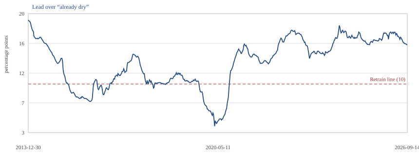
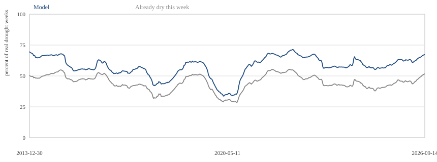
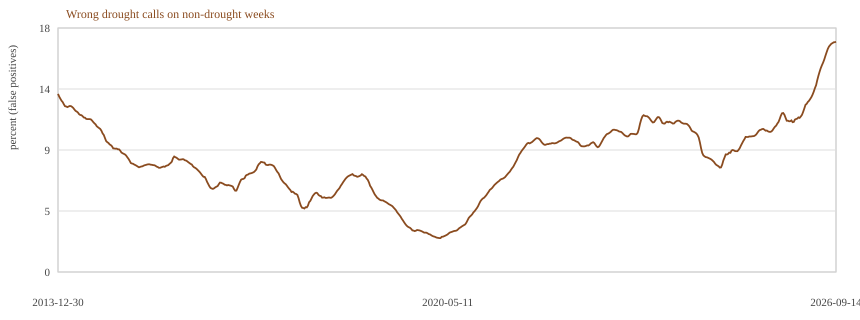

# Streamflow drought monitor

A river can be “low” in two different ways. Eight hundred cubic feet per second might be a problem in April, when snowmelt usually fills the channel, and perfectly normal in September, when many rivers run lower. **Streamflow drought** here means the river is unusually low **for that place and that time of year**, not that the raw number is small.

The U.S. Geological Survey already runs a national forecast for this (they call it River DroughtCast). We are not trying to beat it. The point of this project is to show a **model in production**: a forecast that runs on a schedule against new data, not a notebook we ran once and put on a shelf. It notices when it has gone stale, and it is retrained only when a rule we wrote **before** looking at later years says a new version is actually better. The interesting part is that discipline: live downloads, a fair comparison, and a rule that is allowed to say “do not retrain.”

The river and weather files are not in this GitHub folder. The three charts below update when the Monday job finishes. They are also on the [status page](docs/index.html).

## Current monitor

Each point is the last 52 weeks we already know the answer for.

**Lead over “already dry this week.”** Retrain if this falls below 10 percentage points.



**Share of real droughts caught.**



**False positives.** On weeks that were not drought, how often the model wrongly called drought.



Latest window: 14 September 2026. The September 2020 model is still in use. Lead is 16 points, so we do not retrain.

## What the forecast asks

Every week, for each river station in the lower 48 that sits in the Survey’s 3,229-station drought set, we make **two** four-week forecasts:

1. **How dry?** A number from 0 to 100: how unusual will next month’s flow be for this station and time of year. Low is drier.
2. **Drought, yes or no?** Will that number be at or below 10?

The 10th percentile means: in the 1980–2020 record, only about one week in ten at that station and season was this dry or drier. That is our yes-or-no definition of drought.

Those are two different models, not one guess used two ways. If we train a model to hit the 0–100 number, then call drought whenever that guess is below 10, we almost never catch the weeks that really were drought. The 0–100 model is pulled toward ordinary weeks, because that is most of the data. The yes-or-no model is trained to look for the dry tail. We keep both: the 0–100 forecast for severity, and the yes-or-no forecast for the drought call. The retrain rule watches the yes-or-no call, because that is the product we refuse to let go stale without a written test.

## How we turn flow into “unusual for this time of year”

Take this week’s average flow at one station. Compare it to the same season in each year from 1980 through 2020 (about 40 years). Rank this week among those past weeks. Convert the rank to a number from 0 to 100. Low numbers are unusually dry.  The live score uses the same 1980–2020 comparison so a 10 in 2026 means the same kind of “rare for this week of year” as a 10 in 1995.

## The simple check we always beat (or fail to beat)

Before crediting a fancy model, we ask a dumb question: **is it already dry this week?** If today’s score is already at or below 10, call drought four weeks out. That is not a forecast so much as “drought tends to last.” On 2000–2012 that check caught about 46% of the weeks that really were drought four weeks later, and it falsely flagged about 7% of the weeks that were not.

Any model we keep has to catch **more** of the real droughts than that check, by a margin we wrote down in advance.

## Data prep

The Survey published a rich weekly file for 1980 through March 2020 (about 6.7 million station-weeks, 3,229 stations). That file is frozen. It is what we use to **replay history** and write rules.

After 2020 we have to rebuild the same kinds of columns ourselves: current flow from the Survey’s new water API, weather from gridMET, soil water from NASA, snow from the University of Arizona, short-range weather forecasts, seasonal forecasts, and a few climate indexes (El Niño and the like). That live weekly table is now about 1.07 million station-weeks, 30 March 2020 through 14 September 2026, for 3,220 of those stations. Nine of the 3,229 have no current daily flow in our window; that is missing data, not a download we gave up on. NOAA’s half-degree short-range forecast archive starts 23 September 2020, so the first six months of live weeks have weather and flow but not those forecast columns.

We only train and score on columns we can build both ways. Lake storage and one satellite “actual evaporation” column have the same names in the old file and the new file but are **not** the same measurement (different lakes attached, different units). Those stay out of the matched model so a rule written on 1990s data can still be used in 2026.

## How we refuse to cheat

If you fit a model, then peek at 2013–2020, then pick the cutoff that looks good, you no longer have a test. So we split time on purpose:

1. Train a first model using only weeks whose **outcome** (the week four weeks later) is on or before 31 December 1999.
2. Treat 2000–2012 as a practice decade. Try several replace rules as if we were living through each Monday. Write down how often each rule would have retrained the model, and whether that actually caught more droughts. Pick one rule. Do not change it after this step.
3. Only then score 2013–March 2020, and only then score the live 2020s.

A decision to retrain in a given week may use only outcomes we would already have known by that week. We do not retrain on 2015 and then pretend we used that new model to score 2014.

Running the frozen model every week is **not** the same as retraining. Using an already-trained model on this week’s weather is cheap. Retraining is the step that needs a written rule.

Here is what step 2 actually looked like. The 1999 model was already trained. Each later Monday we could feed that week’s weather and flow into that same model. That is still a four-week forecast. A **replace rule** is a written test that is allowed to say “throw that model out and retrain on everything we know so far.” We walked 2000–2012 under a few of those tests and counted retrains.

**Never retrain.** Zero new models in 13 years. This is the “what if the first model is good enough?” case. Every week still got a four-week forecast. We just refused to retrain.

**Retrain every January.** About a dozen new models — one each New Year, whether the forecast was slipping or not. At the same 0.50 call line, the January models caught 79% of dry weeks and the untouched 1999 model caught 80%. The calendar spent the work of retraining and did not buy a better drought call.

**Retrain if the 0–100 “how dry” guess got 5% or 10% worse.** That sounds like we are watching quality. On 2000–2012 those lines never went off. The rule would have retrained **zero** times — the same as never retrain — while looking as if we had a safety switch.

**Retrain if the share of droughts we catch falls.** That share moves with the weather. A wet year has fewer droughts; a dry year has more. The model can look “worse” because the year was easy or hard, not because the model went stale. We did not use that raw share as the trigger.

**Retrain if this year’s mix of high and low flows looks unlike 1980–1999** (a shift above 0.20). In 2002 the mix looked odd, but the model was still catching droughts well. That would have been a retrain for the wrong reason. We kept that number as a “check that the live columns are still built the same way” watch, not as a retrain trigger.

**Retrain if, over the last 52 weeks we already know the answer for, the model’s lead over “already dry this week” falls below 10 percentage points.** That asks a different question: are we still beating the simple check, on about a year of Mondays, using only answers we would already have had? On 2000–2012 we walked that test **without** actually retraining, so we could see how thin the lead got (once as low as 7 points) and how often a 10-point line would have fired. We wrote 10 points down. Only after 2012 did we allow that line to retrain for real.

The point of the practice decade is that process: watch what each rule would have done, then freeze one. The next sections give the 0.70 call line we also locked on that decade, and the 52-week rule in more detail.

## Model choice and evaluation metric

We use a tree ensemble (LightGBM): many small yes/no splits on weather, recent flow, soil, snow, and forecasts, then an average. We did not copy the Survey’s neural net. The station identifier is not an input; drainage-area columns carry differences between large and small basins.

Drought weeks are only about one week in ten. That rarity is a trap. If we scored the model on “how often is it right,” a model that always said “not drought” would be right about nine weeks out of ten and would still be useless. We care about catching the dry weeks, so while we trained the model we counted each drought week more heavily than each ordinary week. That extra weight is only a training trick: it makes the model look for the dry pattern instead of ignoring it.

After that, the model does not say yes or no. It outputs a **score from 0 to 1**. Higher means “this week looks more like the drought weeks it was shown.” It is tempting to read 0.50 as “even odds” and 0.70 as “a 70% chance.” Because we counted dry weeks extra while training, the score is stretched toward the dry side. It ranks weeks from “least like drought” to “most like drought.” It does not mean “this fraction of similar weeks were drought.”

We used **0.70** as the line we actually call drought on. The next section says what that line caught, and why we did not pick 0.50 or 0.80.

## What we learned on 2000–2012 (rules written here)

There were 244,057 station-weeks of drought in that stretch (about 11% of weeks). A model trained through 1999, then fed each later week’s **current** weather and flow, works as a four-week forecast. The unusual part of that experiment was that we refused to retrain. That answers “what if we never rebuild.”

**Calling drought when the score is at least 0.70** impacts three evaluation metrics:

- **Recall (62%)**: of the weeks that really were drought, the model called drought on 62%. This is “how many dry weeks did we catch?”
- **False-alarm rate (12%)**: of the weeks that were **not** drought, the model still flagged 12%. This is “how often did we cry wolf among the ordinary weeks?”
- **Precision (40%)**: of the weeks **the model** flagged, only 40% were real drought. This is “when the model says drought, how often is it right?”

Those last two can both be true at once. Drought is only about one week in ten, so there are about nine ordinary weeks for every dry one. Flagging 12% of a huge pile of ordinary weeks still produces a lot of wrong flags. Those wrong flags outnumber the correct ones, which is why precision is 40% even though the false-alarm rate looks like “only 12%.”

**40% precision is not great.** It means three of every five drought calls are wrong. We knew that when we picked the line. The simple “already dry this week” check is more precise (about 46% of its flags are real drought) but it only catches 46% of dry weeks. Raising our line to 0.80 gets precision closer to 50% and drops recall to that same 46% — the model then finds no extra droughts. Lowering it to 0.50 catches more dry weeks but flags about a quarter of all ordinary weeks, and only 28% of those flags are real. We chose 0.70 because this product is about catching droughts the simple check misses, and we accepted a messier flag list to get that 62% instead of 46%.

As the practice decade already showed, retraining every January did **not** catch more droughts. Retraining on a calendar is not the product.

The **0–100 “how dry”** model is scored on a different yardstick: how many points off is the guess, on average (mean absolute error). On 2000–2012, “same as today’s 0–100 number” missed by about **21.2** points. A model trained through 1999, then fed each later week’s current weather and flow, missed by about **19.4**. Retraining that model every January moved the error only a couple of tenths of a point (19.2). So the severity model beats “same as today,” and a calendar retrain barely helps it either. We still do not turn that 0–100 guess into a drought call by asking “is the guess below 10?” — on this decade that catch rate was essentially zero. The two models stay separate.

## When we retrain (the rule we actually use)

We do **not** rebuild every January.

Each week, once we know the truth four weeks later, we can score the model. We wait until we have **52 weeks in a row** of those known answers (about one year of Mondays). Then we compare:

- Share of real droughts the model caught in those 52 weeks.
- Share the simple “already dry this week” check caught in the same 52 weeks.

If the model’s lead shrinks **below 10 percentage points**, we retrain on all known outcomes through that week, and we use the new model only afterward. Then we wait 52 more known weeks before we are allowed to retrain again.

If we have fewer than 52 weeks in a row, we do not make a replace-or-keep decision. A three-month slice can look terrible or fine just because of the season.

If the mix of high and low flows looks unlike 1980–1999 (a shift above 0.20), that is a reason to **check for errors in the data**. It is not a reason to throw the model out. We have already seen a “weird looking” year where the model was still catching droughts well.

On 2000–2012, that 52-week lead once fell as low as 7 percentage points. The 10-point line came from whole calendar years. On 52-week slices it is a bit stricter. We left it at 10 and did not move it after seeing later years.

## What happened after we wrote those rules

We scored 2013 through March 2020 with the **same 1999 model and the same 0.70 line**, without peeking to change 0.70. That stretch had 101,235 drought station-weeks. The model caught 59% of the weeks that really were drought. On the weeks that were **not** drought, it wrongly called drought 7.8% of the time. Those wrong calls are **false positives**: the model said drought and the river was not in drought. “Already dry” caught 46% of real droughts and had a 5% false-positive rate (wrongly called drought on 5% of non-drought weeks). The rule held. We did not move 0.70 after seeing those years.

Then we replayed 2013 onward with the **52-week retrain rule**. The model was retrained on five dates when the lead got too small: 4 May 2015, 2 May 2016, 18 December 2017, 23 September 2019, and 21 September 2020. After each of those we waited 52 weeks. We rebuilt the live weekly table from 30 March 2020, the day the Survey’s frozen file ends, so 2021–2023 sit in the same file as 2024–2026.

## Where we are today

The last 52 weeks we can score end 14 September 2026. The September 2020 model is still the one in use. In those 52 weeks it caught **67%** of real droughts; “already dry” caught **52%**. The lead is **16 percentage points**, which is above 10, so we **do not** retrain. On weeks that were not drought, it wrongly called drought **17%** of the time (false positives).

## Fixed goalposts

We will not change 0.70, the 10-point lead, or the 0.20 input-mix line after seeing more years. We will not hunt new data sources for their own sake. Both forecasts stay: the 0–100 “how dry” number, and the yes-or-no drought call. The retrain rule stays attached to the yes-or-no call.

Those three numbers live in `src/streamflow/model.py` so a later week cannot quietly move them.

## It runs every Monday

Each Monday the job pulls new flow and weather, rebuilds the live weekly table, scores the last 52 known weeks, applies the retrain rule, updates the chart page in `docs/`, and can send an email that says keep or retrain.

To run the same programs you need Python 3.11 or newer, a copy of this folder, and the data files that are not on GitHub. Use the project’s own Python environment (a folder named `.venv`), not the Python that came with the computer. Passwords and API keys stay in a local file named `.env`. That file is never uploaded. `.env.example` is a blank list of the names those keys should have.

```powershell
python -m venv .venv
.\.venv\Scripts\python.exe -m pip install -e ".[dev]"
copy .env.example .env
```

Fill in the Survey water-data key and the NASA Earthdata username and password. Then:

```powershell
.\.venv\Scripts\python.exe -m pytest
.\.venv\Scripts\weekly-job.exe
```

Email is optional. If you want it, put the destination address and a mail login in `.env`. For Gmail, the password field must be an [App Password](https://myaccount.google.com/apppasswords), not the password you use to sign in. If those fields are blank, the job still runs.

To start the job every Monday:

```powershell
powershell -File .\scripts\Register-WeeklyJob.ps1
```

The first time the job scores without a saved model on disk, it trains a model through 21 September 2020. That can take several minutes. After that, the saved model files live in a local `models/` folder, not on GitHub.

If you already have the historical weekly file on disk and want to replay every keep-or-retrain decision from 2013 onward, the command is `score-drought-gate`.